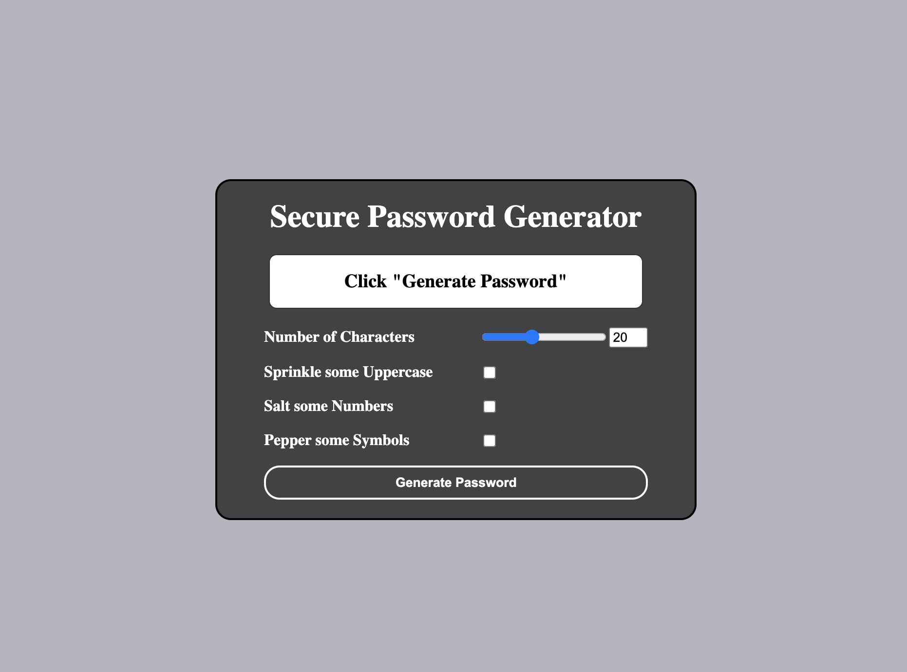

# Password Generator


## Description

Generate a unique password using special characters, letters, and numbers(uppercase + lowercase)

## Table of Contents 

* [Installation](#installation)

* [Usage](#usage)

* [License](#license)

* [Contributing](#contributing)

* [Tests](#tests)

* [Questions](#questions)

## Installation

To install necessary dependencies, run the following command:

```
npm i
```

## License

This project is licensed under the MIT license.

## Tests

To run tests, run the following command:

```
npm test
```

## Questions

If you have any questions about the repo, open an issue or contact me directly at droppindbs@gmail.com. You can find more of my work at [Drop-G](https://github.com/Drop-G/).


[Github](https://drop-g.github.io/PasswordGenerator/)

